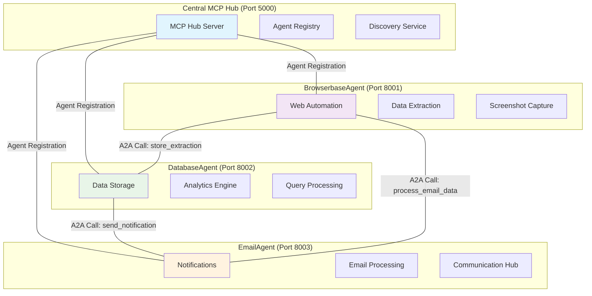

# MCP Protocol Integration with Multi-Agent Architecture

**A comprehensive solution for building intelligent, modular agent systems with seamless Agent-to-Agent (A2A) communication using the Model Context Protocol (MCP) specification.**

## 🌟 Overview

This project implements a **production-ready multi-agent architecture** that enables independent agents to communicate, collaborate, and execute complex workflows. Built on the Model Context Protocol (MCP) specification with JSON-RPC 2.0 compliance, it provides a scalable foundation for AI-powered automation systems.

### 🎯 Core Use Case: Web Data Extraction & Analytics Pipeline

The system demonstrates a complete **web-to-database-to-notification** workflow:

1. **BrowserbaseAgent** (Port 8001): Extracts data from websites using headless browser automation
2. **DatabaseAgent** (Port 8002): Stores extracted data and performs analytics using Anthropic Claude LLM
3. **EmailAgent** (Port 8003): Sends notifications and processes communications
4. **Central Hub** (Port 5000): Orchestrates agent discovery and A2A communication

### 🏗️ Architecture Highlights

- **Disconnected Agent Design**: Each agent runs independently with its own MCP server
- **Hub-Based Discovery**: Central registry for agent capabilities and endpoints
- **Modular Expansion**: Add new agents without modifying existing ones
- **LLM Integration**: Anthropic Claude as default LLM provider with OpenAI fallback
- **Production Ready**: Comprehensive error handling, logging, and monitoring

## 🚀 Key Features

### Real MCP Protocol Compliance
- **JSON-RPC 2.0 Message Format**: All communications follow the JSON-RPC 2.0 specification
- **Tool Discovery and Execution**: Full support for tool registration, discovery, and execution
- **Resource Management**: Framework for managing shared resources between agents
- **Error Handling**: Comprehensive error handling with standard MCP error codes

### Agent-to-Agent (A2A) Communication
- **Agent Registration**: Agents can register themselves with the MCP hub
- **Agent Discovery**: Agents can discover other available agents and their capabilities
- **Inter-Agent Communication**: Agents can call methods on other agents seamlessly
- **Distributed Workflows**: Support for complex multi-agent workflows

### Enhanced Integration
- **Anthropic Claude LLM**: Default integration with Claude-3-Haiku-20240307
- **LangChain Tools**: Seamless integration with LangChain ecosystem
- **Database Operations**: Execute SQL queries, search data, and perform database operations
- **Web Automation**: Browserbase integration for headless browser operations
- **Real-time Tool Loading**: Dynamic tool loading and configuration

## Architecture Overview

### 🏛️ Multi-Agent System Design



### 🔄 Agent Communication Flow

1. **Agent Startup & Registration**
   ```
   Agent → Hub: Register capabilities and endpoint
   Hub → Agent: Confirmation + Agent ID
   Agent → Hub: Start heartbeat (30s intervals)
   ```

2. **Agent Discovery & A2A Communication**
   ```
   Agent A → Hub: Discover agents of type "data_storage"
   Hub → Agent A: DatabaseAgent endpoint details
   Agent A → DatabaseAgent: Direct A2A call via JSON-RPC
   ```

3. **Workflow Execution**
   ```
   BrowserbaseAgent: Extract web data
   ↓ (A2A Call)
   DatabaseAgent: Store + analyze data
   ↓ (A2A Call)  
   EmailAgent: Send notification
   ```

### 🧠 LLM Integration Architecture

- **Default Provider**: Anthropic Claude (claude-3-haiku-20240307)
- **Environment Configuration**: `.env` file with `ANTHROPIC_API_KEY`
- **Fallback Support**: OpenAI GPT models as backup
- **Configuration Management**: Centralized LLM factory pattern

## Project Structure

```
MCPToolCalling/
├── 📁 src/                         # Core source code
│   ├── agents/                     # Agent implementations
│   │   ├── hub/                    # Central MCP hub
│   │   ├── database_agent/         # Database operations agent
│   │   ├── browserbase_agent/      # Web automation agent
│   │   └── email_agent/            # Communication agent
│   ├── client/                     # MCP protocol clients
│   ├── utils/                      # Utility modules
│   └── hub/                        # Hub implementation
├── 📁 docs/                        # Comprehensive documentation
│   ├── architecture/               # Architecture documentation
│   ├── guides/                     # Setup and usage guides
│   └── examples/                   # Code examples and patterns
├── 📁 examples/                    # Working examples
├── 📁 tests/                       # Test suite
├── 📁 config/                      # Configuration files
├── 📁 data/                        # Sample data and databases
├── 📁 .github/workflows/           # CI/CD automation
├── diagnostic.py                   # System health check script
├── quick_start.py                  # Database setup with sample data
├── github_deploy_prep.py           # Deployment preparation script
├── requirements.txt                # Python dependencies
├── .env.example                    # Environment template
└── README.md                       # This file
```

## 🚀 Quick Start

### 1. Environment Setup

```powershell
# Clone the repository
git clone <repository-url>
cd MCPToolCalling

# Create and activate virtual environment
python -m venv .venv
.\.venv\Scripts\Activate.ps1  # Windows PowerShell

# Install dependencies
pip install -r requirements.txt

# Setup environment variables
$env:ANTHROPIC_API_KEY = "your-anthropic-api-key"
$env:BROWSERBASE_API_KEY = "your-browserbase-api-key"    # Optional
$env:BROWSERBASE_PROJECT_ID = "your-project-id"         # Optional
```

### 2. Start the MCP Hub

```powershell
# Start the central MCP hub (required for agent communication)
python src/agents/hub/hub.py
```

The hub will start on `http://localhost:5000` and provide agent discovery services.

### 3. Launch Agents

**PowerShell Window 1: Database Agent**
```powershell
python src/agents/database_agent/database_agent.py
```

**PowerShell Window 2: Browserbase Agent**
```powershell
python src/agents/browserbase_agent/browserbase_agent.py
```

**PowerShell Window 3: Email Agent**
```powershell
python src/agents/email_agent/email_agent.py
```

### 4. Verify System Health

```powershell
# Run comprehensive health check
python diagnostic.py

# Or check specific components
curl http://localhost:5000/agents  # Check registered agents
curl http://localhost:8001/health  # BrowserbaseAgent health
curl http://localhost:8002/health  # DatabaseAgent health
curl http://localhost:8003/health  # EmailAgent health
```

## 🔍 System Health Check

The included diagnostic script provides comprehensive system health monitoring:

```powershell
# Run full system diagnostic
python diagnostic.py
```

The diagnostic checks:
- ✅ **System Resources**: CPU, memory usage, and Python processes
- ✅ **Required Files**: Verifies all agent files and directories exist
- ✅ **Environment Variables**: Confirms API keys are properly set
- ✅ **Agent Connectivity**: Tests all agent endpoints and response times
- ✅ **Database Health**: Validates database accessibility and operations
- ✅ **Network Ports**: Ensures all required ports are available

### Example Output

```
🏥 MCP Multi-Agent System Health Check
============================================================

1️⃣ System Resources
--------------------
CPU Usage: 12.4%
Memory Usage: 45.2% (8GB/16GB)
Python processes: 5

2️⃣ Required Files
--------------------
✅ src/agents/hub/hub.py
✅ src/agents/database_agent/database_agent.py
✅ src/agents/browserbase_agent/browserbase_agent.py
✅ src/agents/email_agent/email_agent.py

3️⃣ Environment Variables
--------------------
✅ ANTHROPIC_API_KEY: ****abc123
✅ BROWSERBASE_API_KEY: ****def456 (optional)

4️⃣ Agent Connectivity
--------------------
✅ Hub: 0.125s
✅ BrowserbaseAgent: 0.089s
✅ DatabaseAgent: 0.156s
✅ EmailAgent: 0.134s

5️⃣ Database Health
--------------------
✅ Database accessible: 42 records in extractions table

📋 Diagnostic Summary
--------------------
🎉 All checks passed! System is healthy.
```

## 📚 Documentation

### Complete Documentation Suite
All comprehensive documentation is now organized in the `docs/` folder:

- **📋 [Documentation Index](docs/README.md)** - Start here for navigation
- **🏛️ [Architecture Documentation](docs/architecture/)** - Technical design and patterns  
- **📖 [User Guides](docs/guides/)** - Setup, usage, and development guides
- **🚀 [Examples](docs/examples/)** - Code examples and workflow patterns

### Quick Links
- **Getting Started**: [Quick Start Guide](#-quick-start)
- **System Health**: [Diagnostic Script](#-system-health-check)
- **GitHub Issues**: [GitHub Push Troubleshooting](GITHUB_PUSH_TROUBLESHOOTING.md)
- **Troubleshooting**: [docs/guides/TROUBLESHOOTING.md](docs/guides/TROUBLESHOOTING.md)
- **Agent Development**: [docs/guides/ADDING_NEW_AGENTS.md](docs/guides/ADDING_NEW_AGENTS.md)

## 🎯 Use Cases

### 1. Automated Web Research Pipeline
- **BrowserbaseAgent**: Scrape research articles and news
- **DatabaseAgent**: Store and categorize findings  
- **EmailAgent**: Send weekly research summaries

### 2. Business Intelligence Automation
- **DatabaseAgent**: Query sales and customer data
- **AnalyticsAgent**: Generate insights and predictions
- **ReportAgent**: Create formatted reports and dashboards

### 3. Customer Support Automation  
- **EmailAgent**: Process incoming support requests
- **DatabaseAgent**: Check customer history and preferences
- **ChatbotAgent**: Generate personalized responses

### 4. Content Management System
- **FileAgent**: Process uploaded documents
- **AIAgent**: Extract metadata and summarize content
- **DatabaseAgent**: Store with searchable indexing

## 🤝 Contributing

1. **Fork the repository**
2. **Create a feature branch**: `git checkout -b feature/your-agent-name`
3. **Follow the agent template** in `docs/guides/ADDING_AGENTS.md`
4. **Add comprehensive tests** for your agent
5. **Update documentation** with your agent's capabilities
6. **Submit a pull request** with detailed description

### Development Guidelines
- **Follow the A2A pattern** for inter-agent communication
- **Use the LLM factory** for consistent LLM integration
- **Include error handling** and comprehensive logging
- **Add JSON-RPC 2.0 compliant** endpoints
- **Register capabilities** with the central hub

## 📄 License

This project is licensed under the MIT License - see the [LICENSE](LICENSE) file for details.

## 🙏 Acknowledgments

- **Model Context Protocol (MCP)** specification by Anthropic
- **LangChain** framework for LLM integrations
- **Browserbase** for headless browser automation
- **JSON-RPC 2.0** specification for standardized communication

---

**🚀 Ready to build your multi-agent system?** Start with the [Quick Start](#-quick-start) guide and explore the [examples](examples/) directory for inspiration!
"# multiagentarchitecture" 
