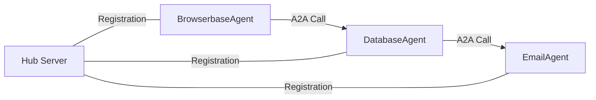

# MCP Multi-Agent System Documentation

This directory contains comprehensive documentation for the MCP Protocol Integration with Multi-Agent Architecture solution.

## 📁 Documentation Structure

### 🏛️ Architecture Documentation (`architecture/`)

| Document | Description | Last Updated |
|----------|-------------|--------------|
| [`MCP_PROTOCOL_GUIDE.md`](architecture/MCP_PROTOCOL_GUIDE.md) | Complete MCP protocol implementation details | 2025-07-12 |
| [`HUB_ARCHITECTURE_COMPLETE.md`](architecture/HUB_ARCHITECTURE_COMPLETE.md) | Central hub design and API specification | 2025-07-12 |
| [`A2A_IMPLEMENTATION_SUMMARY.md`](architecture/A2A_IMPLEMENTATION_SUMMARY.md) | Agent-to-Agent communication patterns | 2025-07-12 |
| [`MULTI_AGENT_DESIGN.md`](architecture/MULTI_AGENT_DESIGN.md) | Overall system architecture and design decisions | 2025-07-12 |

### 📚 Setup & Usage Guides (`guides/`)

| Guide | Purpose | Audience |
|-------|---------|----------|
| [`ANTHROPIC_INTEGRATION_COMPLETE.md`](guides/ANTHROPIC_INTEGRATION_COMPLETE.md) | LLM integration with Anthropic Claude | Developers |
| [`BROWSERBASE_AGENT_COMPLETE.md`](guides/BROWSERBASE_AGENT_COMPLETE.md) | Web automation agent setup | Developers |
| [`PRODUCTION_SETUP_GUIDE.md`](guides/PRODUCTION_SETUP_GUIDE.md) | Production deployment guide | DevOps |
| [`BUILD_AND_RUN.md`](guides/BUILD_AND_RUN.md) | Development environment setup | Developers |
| [`DATABASE_AGENT_USAGE.md`](guides/DATABASE_AGENT_USAGE.md) | Database agent capabilities | End Users |
| [`ADDING_NEW_AGENTS.md`](guides/ADDING_NEW_AGENTS.md) | How to create custom agents | Developers |

### 💡 Examples & Workflows (`examples/`)

| Example | Description | Complexity |
|---------|-------------|------------|
| [`agent_orchestration_workflow.py`](examples/agent_orchestration_workflow.py) | Complete multi-agent workflow | Advanced |
| [`WORKFLOW_PATTERNS.md`](examples/WORKFLOW_PATTERNS.md) | Common workflow patterns | Intermediate |
| [`INTEGRATION_EXAMPLES.md`](examples/INTEGRATION_EXAMPLES.md) | Real-world integration examples | Intermediate |
| [`SIMPLE_AGENT_EXAMPLES.md`](examples/SIMPLE_AGENT_EXAMPLES.md) | Basic agent usage examples | Beginner |

## 🚀 Getting Started

1. **New to the System?** Start with the [Main README](../README.md)
2. **Setting up Development?** Follow [`BUILD_AND_RUN.md`](guides/BUILD_AND_RUN.md)
3. **Understanding Architecture?** Read [`MULTI_AGENT_DESIGN.md`](architecture/MULTI_AGENT_DESIGN.md)
4. **Adding Agents?** See [`ADDING_NEW_AGENTS.md`](guides/ADDING_NEW_AGENTS.md)
5. **Production Deployment?** Follow [`PRODUCTION_SETUP_GUIDE.md`](guides/PRODUCTION_SETUP_GUIDE.md)

## 🔧 Key Concepts

### Agent Types and Capabilities

| Agent Type | Port | Primary Function | A2A Methods |
|------------|------|------------------|-------------|
| **DatabaseAgent** | 8002 | Data storage & analytics | `store_extraction`, `execute_query`, `analyze_data` |
| **BrowserbaseAgent** | 8001 | Web automation | `extract_website_data`, `take_screenshot`, `navigate_to_url` |
| **EmailAgent** | 8003 | Communications | `send_notification`, `process_email_data` |
| **Hub Server** | 5000 | Agent registry & discovery | `agents/register`, `agents/discover` |

### Communication Patterns



### LLM Integration

- **Primary**: Anthropic Claude (claude-3-haiku-20240307)
- **Configuration**: Environment variables via `.env`
- **Fallback**: OpenAI GPT models
- **Factory Pattern**: Centralized LLM provider management

## 🧪 Testing & Validation

### Test Categories

| Test Type | Location | Purpose |
|-----------|----------|---------|
| **Integration Tests** | `../tests/test_*_integration.py` | End-to-end agent communication |
| **Protocol Tests** | `../tests/test_mcp_*.py` | MCP protocol compliance |
| **A2A Tests** | `../tests/test_a2a_*.py` | Agent-to-agent communication |
| **Unit Tests** | `../tests/test_*.py` | Individual component testing |

### Validation Scripts

```bash
# Test Anthropic integration
python test_anthropic_integration.py

# Validate A2A communication
python test_a2a_integration.py

# Check MCP protocol compliance
python tests/validate_mcp.py
```

## 🔍 Troubleshooting Quick Reference

| Issue | Quick Fix | Documentation |
|-------|-----------|---------------|
| Agent registration failed | Check hub is running on port 5000 | [HUB_ARCHITECTURE](architecture/HUB_ARCHITECTURE_COMPLETE.md) |
| LLM authentication error | Verify `ANTHROPIC_API_KEY` in `.env` | [ANTHROPIC_INTEGRATION](guides/ANTHROPIC_INTEGRATION_COMPLETE.md) |
| A2A communication timeout | Check agent endpoints and ports | [A2A_IMPLEMENTATION](architecture/A2A_IMPLEMENTATION_SUMMARY.md) |
| Tool loading failure | Restart MCP client and clear cache | [BUILD_AND_RUN](guides/BUILD_AND_RUN.md) |

## 📈 Roadmap & Extensions

### Planned Enhancements

1. **Additional Agent Types**
   - FileProcessingAgent (PDF, document handling)
   - IntegrationAgent (CRM, ERP connections)
   - MonitoringAgent (system health, metrics)

2. **Enhanced Features**
   - Visual workflow designer
   - Agent performance metrics
   - Distributed deployment support
   - Enhanced error recovery

3. **Integration Improvements**
   - More LLM providers (OpenAI, Claude, local models)
   - Enhanced tool discovery mechanisms
   - Real-time agent status monitoring

### Contributing

See the main [README](../README.md#-contributing) for contribution guidelines.

## 📞 Support & Community

- **Issues**: Create GitHub issues for bugs or feature requests
- **Discussions**: Use GitHub discussions for questions
- **Documentation**: Contribute to docs by submitting PRs

---

**📝 Documentation maintained by the MCP Multi-Agent System team**  
**Last updated**: July 12, 2025
