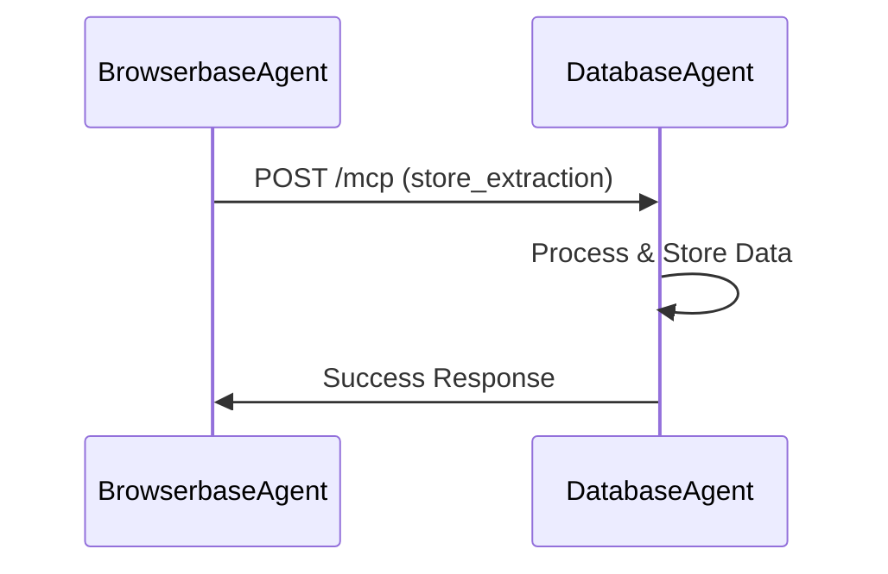
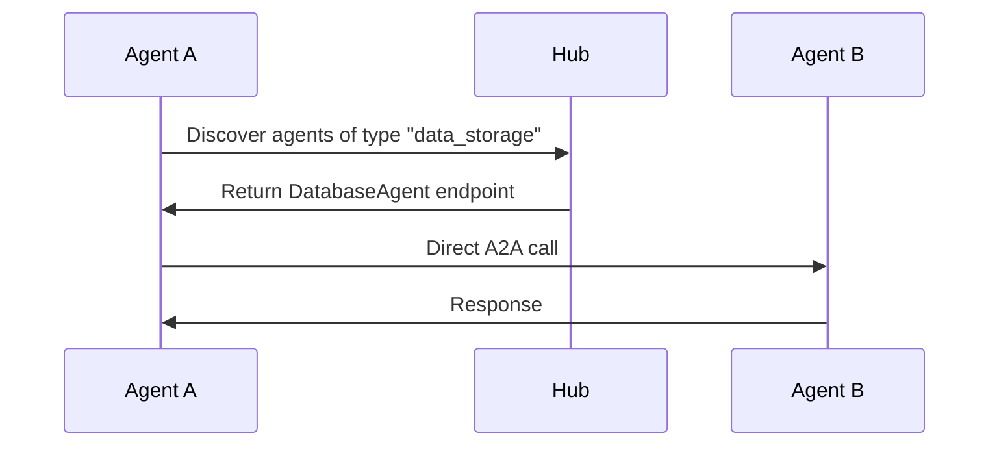
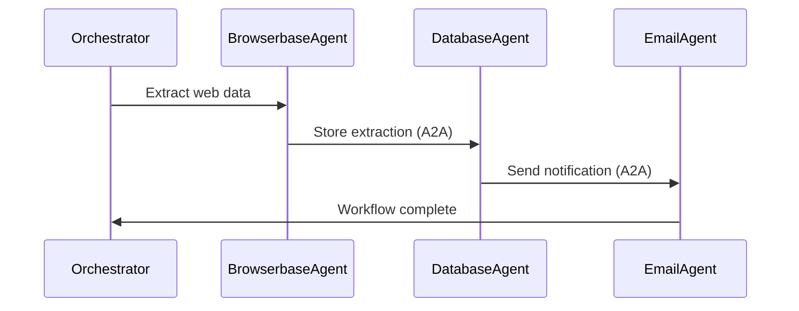

# Multi-Agent System Architecture Design

## Overview

This document describes the architectural design decisions and patterns used in the MCP Protocol Integration with Multi-Agent Architecture solution.

## 🏗️ Core Architecture Principles

### 1. Disconnected Agent Design

Each agent operates as an **independent microservice** with its own:
- MCP server endpoint (unique port)
- LLM instance and configuration
- Tool set and capabilities
- Error handling and logging
- State management

**Benefits:**
- **Fault Isolation**: One agent failure doesn't crash the system
- **Independent Scaling**: Scale agents based on demand
- **Technology Diversity**: Different agents can use different technologies
- **Development Independence**: Teams can work on agents separately

### 2. Hub-Based Discovery Pattern

The **Central MCP Hub** (port 5000) provides:
- Agent registration and capability discovery
- Health monitoring via heartbeats
- Service catalog with endpoint routing
- Load balancing and failover (future enhancement)

```python
# Agent Registration Pattern
registration_data = {
    "agent_id": "database-agent-abc123",
    "agent_type": "data_storage",
    "endpoint_url": "http://localhost:8002",
    "capabilities": [
        {
            "name": "store_extraction",
            "description": "Store web extraction data",
            "input_schema": {...},
            "output_schema": {...}
        }
    ]
}
```

### 3. JSON-RPC 2.0 Communication Protocol

All inter-agent communication follows **JSON-RPC 2.0** specification:
- Standardized request/response format
- Error code consistency
- Async and sync operation support
- Transport layer independence

```python
# A2A Communication Example
request = {
    "jsonrpc": "2.0",
    "method": "store_extraction",
    "params": {
        "url": "https://example.com",
        "title": "Article Title",
        "extracted_data": {...}
    },
    "id": "request-123"
}
```

## 🔄 Agent Communication Patterns

### Pattern 1: Direct A2A Communication



### Pattern 2: Hub-Mediated Discovery



### Pattern 3: Workflow Orchestration



## 🧠 LLM Integration Architecture

### Centralized LLM Factory Pattern

```python
# src/utils/llm_factory.py
def create_llm_from_config(config_manager, temperature=0.1):
    """Factory method for LLM creation based on configuration."""
    
    provider = config_manager.llm_config.provider  # "anthropic" or "openai"
    
    if provider == "anthropic":
        return ChatAnthropic(
            model=config_manager.llm_config.model,
            api_key=os.getenv("ANTHROPIC_API_KEY"),
            temperature=temperature
        )
    elif provider == "openai":
        return ChatOpenAI(
            model=config_manager.llm_config.model,
            api_key=os.getenv("OPENAI_API_KEY"),
            temperature=temperature
        )
```

### Configuration Hierarchy

1. **Environment Variables** (`.env` file) - Highest priority
2. **Configuration Files** (`config/llm.yaml`) - Medium priority  
3. **Default Values** (Anthropic Claude) - Fallback

### Agent-Specific LLM Usage

Each agent initializes its own LLM instance:

```python
# Database Agent LLM Integration
class DatabaseAgent:
    def __init__(self, ...):
        # LLM initialization with fallback
        try:
            config_manager = ConfigManager()
            self.llm = create_llm_from_config(config_manager, temperature)
        except Exception as e:
            # Fallback to direct initialization
            self.llm = ChatAnthropic(
                model="claude-3-haiku-20240307",
                api_key=os.getenv("ANTHROPIC_API_KEY"),
                temperature=temperature
            )
```

## 🔧 Database Agent Architecture Deep Dive

### Core Components

```python
class DatabaseAgent:
    """
    Intelligent database agent with natural language processing capabilities.
    """
    
    # Core Components
    self.llm              # Anthropic Claude LLM instance
    self.tools_factory    # MCP tool factory
    self.tools           # Available MCP tools
    self.agent_executor  # LangChain agent executor
    
    # A2A Communication
    self.agent_id        # Unique agent identifier
    self.agent_port      # Server port (8002)
    self.hub_url         # Central hub URL
    
    # State Management
    self.registered_with_hub  # Registration status
    self.heartbeat_task      # Background heartbeat task
```

### A2A Method Architecture

The DatabaseAgent exposes several A2A methods that other agents can call:

```python
# A2A Methods (called by other agents)
async def store_extraction(self, url, title, content, extracted_data, extraction_type, metadata):
    """Store web extraction data from BrowserbaseAgent."""
    
async def execute_query(self, query, params=None):
    """Execute database queries for other agents."""
    
async def analyze_data(self, analysis_request, include_visualizations=False):
    """Perform data analysis and return insights."""
```

### Tool Loading Architecture

```python
def _load_tools(self) -> List[BaseTool]:
    """Load MCP tools with protocol detection."""
    
    if self.use_mcp_protocol:
        # New MCP protocol (JSON-RPC 2.0)
        tools = self._load_mcp_protocol_tools()
    else:
        # Legacy toolbox client
        tools = create_langchain_tools_sync(self.mcp_client, self.toolset_name)
    
    return tools
```

### Agent Executor Architecture

```python
def _create_agent(self) -> AgentExecutor:
    """Create LangChain agent with MCP tools."""
    
    # Prompt template with system instructions
    prompt = ChatPromptTemplate.from_messages([
        ("system", self._get_system_prompt()),
        MessagesPlaceholder("chat_history", optional=True),
        ("human", "{input}"),
        MessagesPlaceholder("agent_scratchpad"),
    ])
    
    # OpenAI tools agent (compatible with Anthropic Claude)
    agent = create_openai_tools_agent(
        llm=self.llm,
        tools=self.tools,
        prompt=prompt
    )
    
    return AgentExecutor(
        agent=agent,
        tools=self.tools,
        max_iterations=self.max_iterations,
        verbose=True,
        return_intermediate_steps=True,
        handle_parsing_errors=True
    )
```

## 🚀 Extensibility Design

### Adding New Agents

The architecture supports easy agent addition through:

1. **Agent Template Pattern**
2. **Standardized A2A Interface**
3. **Hub Registration Protocol**
4. **Common LLM Factory**

### Agent Type Categories

| Category | Purpose | Example Agents |
|----------|---------|----------------|
| **Data Processing** | Storage, analysis, transformation | DatabaseAgent, AnalyticsAgent |
| **External Integration** | Web, APIs, services | BrowserbaseAgent, APIAgent |
| **Communication** | Notifications, messaging | EmailAgent, SlackAgent |
| **Content Processing** | Files, documents, media | FileAgent, PDFAgent |
| **Monitoring** | Health, metrics, alerts | MonitoringAgent, LogAgent |

### Workflow Orchestration Patterns

```python
class AgentOrchestrator:
    """Orchestrates complex multi-agent workflows."""
    
    async def web_extraction_workflow(self, url, notify_email):
        """Example: Web → Database → Email workflow."""
        
        # Step 1: Extract web data
        browserbase_agent = await self._discover_agent("web_automation")
        extraction_result = await self._call_agent(
            browserbase_agent["endpoint_url"],
            "extract_website_data",
            {"url": url, "store_in_database": True}
        )
        
        # Step 2: Verify storage (automatic via A2A)
        database_agent = await self._discover_agent("data_storage")
        verification = await self._call_agent(
            database_agent["endpoint_url"],
            "query_data",
            {"question": f"Show recent extraction from {url}"}
        )
        
        # Step 3: Send notification
        email_agent = await self._discover_agent("communication")
        await self._call_agent(
            email_agent["endpoint_url"],
            "send_notification",
            {
                "recipient": notify_email,
                "subject": "Extraction Complete",
                "body": f"Data from {url} has been processed and stored."
            }
        )
```

## 🔒 Security & Error Handling

### Security Considerations

1. **Agent Authentication**: Currently localhost-based, extensible to token-based auth
2. **API Key Management**: Environment variables with rotation support
3. **Network Security**: CORS enabled, can be configured for production
4. **Input Validation**: JSON-RPC schema validation

### Error Handling Patterns

```python
# Standardized Error Response
{
    "jsonrpc": "2.0",
    "error": {
        "code": -32603,  # Internal error
        "message": "Agent processing failed",
        "data": {
            "agent_id": "database-agent-abc123",
            "timestamp": "2025-07-12T10:00:00Z",
            "details": "Connection timeout to database"
        }
    },
    "id": "request-123"
}
```

### Fault Tolerance

- **Agent Isolation**: Failures don't cascade
- **Heartbeat Monitoring**: Hub detects dead agents
- **Graceful Degradation**: Fallback to alternative agents
- **Retry Logic**: Configurable retry policies

## 📊 Performance & Scalability

### Current Limitations

- **Single Host**: All agents run on localhost
- **No Load Balancing**: One instance per agent type
- **Synchronous Processing**: Limited concurrent request handling

### Scalability Roadmap

1. **Horizontal Scaling**: Multiple instances per agent type
2. **Load Balancing**: Hub-based request distribution
3. **Distributed Deployment**: Multi-host agent deployment
4. **Async Processing**: Full async/await implementation
5. **Resource Pooling**: Shared LLM and database connections

### Performance Metrics

| Component | Typical Response Time | Throughput |
|-----------|----------------------|------------|
| Hub Registration | < 100ms | 1000 req/sec |
| A2A Method Call | < 500ms | 100 req/sec |
| Database Query | < 2s | 50 req/sec |
| Web Extraction | < 10s | 10 req/sec |

## 🎯 Design Decisions & Trade-offs

### Why JSON-RPC 2.0?

**Pros:**
- Standardized protocol
- Language agnostic
- Simple error handling
- Wide tooling support

**Cons:**
- HTTP overhead
- Not as performant as binary protocols
- Limited streaming support

### Why LangChain Integration?

**Pros:**
- Rich ecosystem
- Tool abstractions
- Agent frameworks
- Community support

**Cons:**
- Framework dependency
- Learning curve
- Version compatibility

### Why Anthropic Claude Default?

**Pros:**
- Excellent code generation
- Strong reasoning capabilities
- JSON output reliability
- Competitive pricing

**Cons:**
- API dependency
- Rate limiting
- Regional availability

---

**This architecture provides a solid foundation for building sophisticated multi-agent systems while maintaining simplicity and extensibility.**
