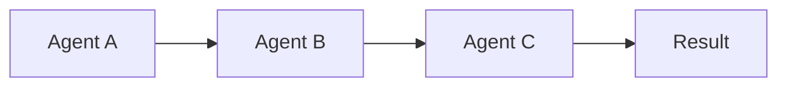
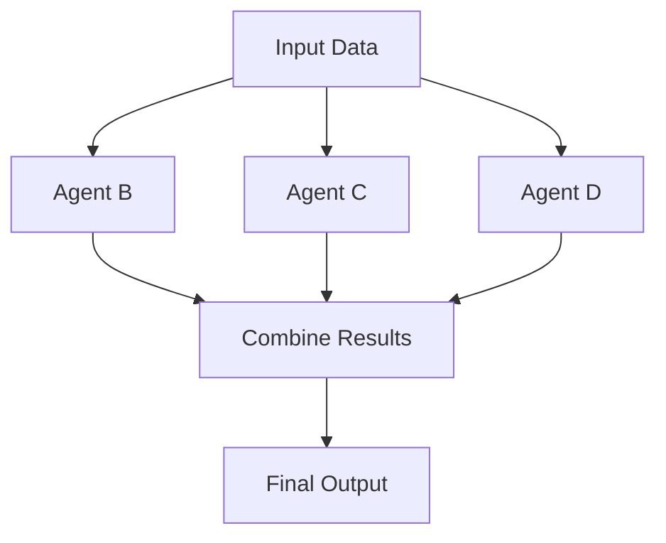
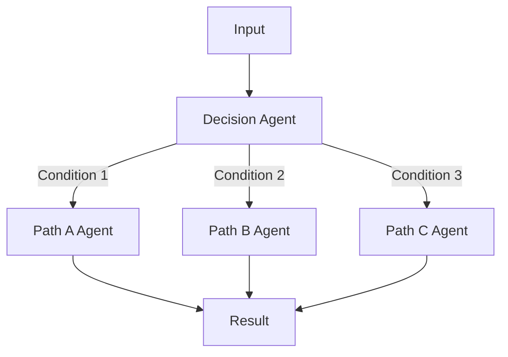
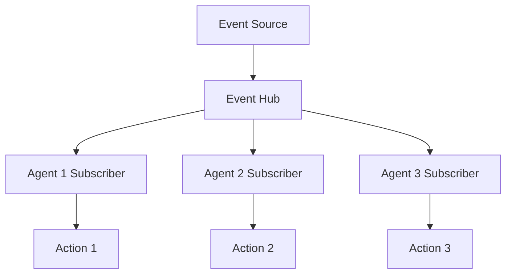
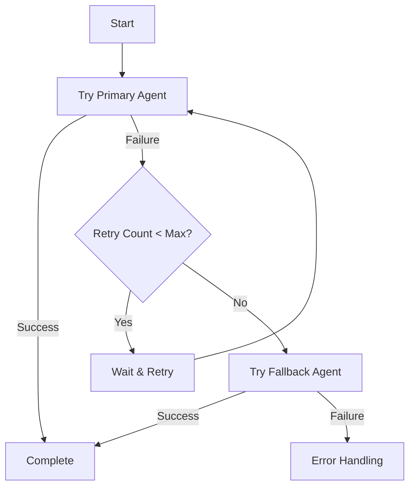

# Workflow Patterns for MCP Multi-Agent System

## Overview

This document describes common workflow patterns and best practices for orchestrating multi-agent operations in the MCP system.

## 🔄 Core Workflow Patterns

### Pattern 1: Linear Pipeline

**Description**: Sequential processing where each agent's output becomes the next agent's input.



**Implementation**:
```python
async def linear_pipeline_workflow(self, initial_data: Dict) -> Dict:
    """Linear processing pipeline."""
    
    # Step 1: Agent A processing
    agent_a = await self._discover_agent("agent_type_a")
    result_a = await self._call_agent(
        agent_a["endpoint_url"],
        "process_data",
        {"input": initial_data}
    )
    
    # Step 2: Agent B processing (uses A's output)
    agent_b = await self._discover_agent("agent_type_b")
    result_b = await self._call_agent(
        agent_b["endpoint_url"],
        "transform_data",
        {"input": result_a}
    )
    
    # Step 3: Agent C processing (uses B's output)
    agent_c = await self._discover_agent("agent_type_c")
    final_result = await self._call_agent(
        agent_c["endpoint_url"],
        "finalize_data",
        {"input": result_b}
    )
    
    return final_result
```

**Use Cases**:
- Web data extraction → Database storage → Email notification
- Document upload → Text extraction → Analysis → Report generation
- API data fetch → Data cleaning → Analytics → Dashboard update

### Pattern 2: Parallel Processing

**Description**: Multiple agents process data simultaneously, results are combined.



**Implementation**:
```python
async def parallel_processing_workflow(self, data: Dict) -> Dict:
    """Parallel processing with result combination."""
    
    # Discover all agents
    agents = await asyncio.gather(
        self._discover_agent("analysis_agent"),
        self._discover_agent("validation_agent"),
        self._discover_agent("enrichment_agent")
    )
    
    # Parallel processing
    tasks = [
        self._call_agent(agents[0]["endpoint_url"], "analyze", {"data": data}),
        self._call_agent(agents[1]["endpoint_url"], "validate", {"data": data}),
        self._call_agent(agents[2]["endpoint_url"], "enrich", {"data": data})
    ]
    
    # Wait for all to complete
    analysis_result, validation_result, enrichment_result = await asyncio.gather(
        *tasks, return_exceptions=True
    )
    
    # Combine results
    combined_result = {
        "original_data": data,
        "analysis": analysis_result if not isinstance(analysis_result, Exception) else None,
        "validation": validation_result if not isinstance(validation_result, Exception) else None,
        "enrichment": enrichment_result if not isinstance(enrichment_result, Exception) else None,
        "processing_complete": True
    }
    
    return combined_result
```

**Use Cases**:
- Multi-source data validation
- Parallel content analysis (sentiment, entities, topics)
- Simultaneous format conversions
- Independent quality checks

### Pattern 3: Conditional Branching

**Description**: Workflow path depends on data content or agent results.



**Implementation**:
```python
async def conditional_workflow(self, data: Dict) -> Dict:
    """Conditional processing based on data characteristics."""
    
    # Decision logic
    data_type = data.get("type", "unknown")
    content_size = len(str(data.get("content", "")))
    
    if data_type == "document" and content_size > 10000:
        # Large document processing
        agent = await self._discover_agent("document_processor")
        result = await self._call_agent(
            agent["endpoint_url"],
            "process_large_document",
            {"document": data, "chunking": True}
        )
        
    elif data_type == "image":
        # Image processing
        agent = await self._discover_agent("image_processor")
        result = await self._call_agent(
            agent["endpoint_url"],
            "analyze_image",
            {"image_data": data}
        )
        
    elif data_type == "structured":
        # Structured data processing
        agent = await self._discover_agent("data_processor")
        result = await self._call_agent(
            agent["endpoint_url"],
            "process_structured_data",
            {"structured_data": data}
        )
        
    else:
        # Default processing
        agent = await self._discover_agent("general_processor")
        result = await self._call_agent(
            agent["endpoint_url"],
            "general_processing",
            {"data": data}
        )
    
    return result
```

**Use Cases**:
- Content-based routing
- Error handling with fallback paths
- User permission-based processing
- Data quality-based workflows

### Pattern 4: Event-Driven Processing

**Description**: Agents react to events from other agents or external sources.



**Implementation**:
```python
class EventDrivenOrchestrator:
    """Event-driven workflow orchestrator."""
    
    def __init__(self):
        self.event_handlers = {}
        self.event_queue = asyncio.Queue()
    
    def register_handler(self, event_type: str, handler_func):
        """Register event handler."""
        if event_type not in self.event_handlers:
            self.event_handlers[event_type] = []
        self.event_handlers[event_type].append(handler_func)
    
    async def emit_event(self, event_type: str, event_data: Dict):
        """Emit an event."""
        await self.event_queue.put({
            "type": event_type,
            "data": event_data,
            "timestamp": datetime.utcnow().isoformat()
        })
    
    async def process_events(self):
        """Process events from the queue."""
        while True:
            try:
                event = await self.event_queue.get()
                event_type = event["type"]
                
                if event_type in self.event_handlers:
                    # Process all handlers for this event type
                    tasks = [
                        handler(event["data"])
                        for handler in self.event_handlers[event_type]
                    ]
                    await asyncio.gather(*tasks, return_exceptions=True)
                
                self.event_queue.task_done()
                
            except Exception as e:
                logger.error(f"Event processing error: {e}")

# Usage example
async def setup_event_driven_workflow():
    orchestrator = EventDrivenOrchestrator()
    
    # Register event handlers
    orchestrator.register_handler("data_extracted", handle_data_storage)
    orchestrator.register_handler("data_extracted", handle_notification)
    orchestrator.register_handler("error_occurred", handle_error_recovery)
    
    # Start event processing
    asyncio.create_task(orchestrator.process_events())
    
    return orchestrator

async def handle_data_storage(data):
    """Handle data storage event."""
    database_agent = await discover_agent("data_storage")
    await call_agent(database_agent, "store_data", data)

async def handle_notification(data):
    """Handle notification event."""
    email_agent = await discover_agent("communication")
    await call_agent(email_agent, "send_notification", {
        "message": f"Data processed: {data['summary']}"
    })
```

**Use Cases**:
- Real-time data processing
- Microservices event messaging
- Workflow state changes
- External webhook processing

### Pattern 5: Retry and Recovery

**Description**: Robust error handling with retry logic and fallback mechanisms.



**Implementation**:
```python
async def resilient_workflow(
    self, 
    data: Dict, 
    max_retries: int = 3,
    retry_delay: float = 2.0
) -> Dict:
    """Workflow with retry logic and fallback mechanisms."""
    
    primary_agent_type = "primary_processor"
    fallback_agent_type = "fallback_processor"
    
    # Try primary agent with retries
    for attempt in range(max_retries):
        try:
            primary_agent = await self._discover_agent(primary_agent_type)
            
            if primary_agent:
                result = await self._call_agent(
                    primary_agent["endpoint_url"],
                    "process_data",
                    {"data": data},
                    timeout=30  # 30 second timeout
                )
                
                logger.info(f"Primary agent succeeded on attempt {attempt + 1}")
                return {
                    "status": "success",
                    "agent": "primary",
                    "attempt": attempt + 1,
                    "result": result
                }
        
        except Exception as e:
            logger.warning(f"Primary agent attempt {attempt + 1} failed: {e}")
            
            if attempt < max_retries - 1:
                # Exponential backoff
                delay = retry_delay * (2 ** attempt)
                await asyncio.sleep(delay)
    
    # Primary agent failed, try fallback
    try:
        logger.info("Trying fallback agent")
        fallback_agent = await self._discover_agent(fallback_agent_type)
        
        if fallback_agent:
            result = await self._call_agent(
                fallback_agent["endpoint_url"],
                "process_data_fallback",
                {"data": data, "primary_failed": True}
            )
            
            logger.info("Fallback agent succeeded")
            return {
                "status": "success",
                "agent": "fallback",
                "result": result,
                "note": "Primary agent failed, used fallback"
            }
    
    except Exception as e:
        logger.error(f"Fallback agent also failed: {e}")
    
    # Both failed
    return {
        "status": "failed",
        "error": "Both primary and fallback agents failed",
        "data": data
    }
```

**Use Cases**:
- Critical data processing
- External API integrations
- Network-dependent operations
- Production workflow reliability

## 🎯 Real-World Workflow Examples

### Example 1: Web Research Pipeline

```python
async def web_research_workflow(self, research_topic: str) -> Dict:
    """Complete web research workflow."""
    
    workflow_id = f"research_{uuid.uuid4().hex[:8]}"
    results = {"workflow_id": workflow_id, "topic": research_topic, "steps": []}
    
    try:
        # Step 1: Web search and extraction
        browserbase_agent = await self._discover_agent("web_automation")
        search_urls = [
            f"https://www.google.com/search?q={research_topic}",
            f"https://scholar.google.com/scholar?q={research_topic}",
            f"https://www.reddit.com/search?q={research_topic}"
        ]
        
        extraction_tasks = [
            self._call_agent(
                browserbase_agent["endpoint_url"],
                "extract_website_data",
                {"url": url, "extraction_type": "research"}
            )
            for url in search_urls
        ]
        
        extraction_results = await asyncio.gather(*extraction_tasks, return_exceptions=True)
        
        # Step 2: Compile and store research data
        database_agent = await self._discover_agent("data_storage")
        
        for i, result in enumerate(extraction_results):
            if not isinstance(result, Exception):
                await self._call_agent(
                    database_agent["endpoint_url"],
                    "store_extraction",
                    {
                        "url": search_urls[i],
                        "title": f"Research: {research_topic}",
                        "content": result.get("content", ""),
                        "extracted_data": result,
                        "extraction_type": "research",
                        "metadata": {
                            "research_topic": research_topic,
                            "workflow_id": workflow_id
                        }
                    }
                )
        
        # Step 3: Analyze and summarize research
        analysis_result = await self._call_agent(
            database_agent["endpoint_url"],
            "analyze_data",
            {
                "analysis_request": f"""
                Analyze all research data for topic: {research_topic}
                
                Provide:
                1. Key findings and insights
                2. Summary of sources and credibility
                3. Trending themes and patterns
                4. Recommendations for further research
                """,
                "include_visualizations": True
            }
        )
        
        # Step 4: Generate research report
        report_data = {
            "topic": research_topic,
            "workflow_id": workflow_id,
            "sources_analyzed": len([r for r in extraction_results if not isinstance(r, Exception)]),
            "analysis": analysis_result.get("answer", ""),
            "generated_at": datetime.utcnow().isoformat()
        }
        
        # Step 5: Send research report notification
        email_agent = await self._discover_agent("communication")
        await self._call_agent(
            email_agent["endpoint_url"],
            "send_notification",
            {
                "recipient": "researcher@company.com",
                "subject": f"Research Complete: {research_topic}",
                "body": f"""
                Research workflow completed for: {research_topic}
                
                Summary: {analysis_result.get('answer', '')[:500]}...
                
                Full results available in database with workflow ID: {workflow_id}
                """,
                "priority": "normal"
            }
        )
        
        results["status"] = "completed"
        results["report"] = report_data
        
    except Exception as e:
        logger.error(f"Research workflow error: {e}")
        results["status"] = "failed"
        results["error"] = str(e)
    
    return results
```

### Example 2: Customer Data Processing

```python
async def customer_data_workflow(self, customer_data: Dict) -> Dict:
    """Process customer data through multiple validation and enrichment steps."""
    
    workflow_id = f"customer_{uuid.uuid4().hex[:8]}"
    
    # Step 1: Parallel validation
    validation_tasks = [
        self._call_agent("http://localhost:8010/mcp", "validate_email", {
            "email": customer_data.get("email")
        }),
        self._call_agent("http://localhost:8011/mcp", "validate_phone", {
            "phone": customer_data.get("phone")
        }),
        self._call_agent("http://localhost:8012/mcp", "validate_address", {
            "address": customer_data.get("address")
        })
    ]
    
    validation_results = await asyncio.gather(*validation_tasks, return_exceptions=True)
    
    # Step 2: Data enrichment based on validation
    if all(not isinstance(r, Exception) for r in validation_results):
        # All validations passed - proceed with enrichment
        enrichment_agent = await self._discover_agent("data_enrichment")
        
        enriched_data = await self._call_agent(
            enrichment_agent["endpoint_url"],
            "enrich_customer_data",
            {
                "customer_data": customer_data,
                "validation_results": validation_results
            }
        )
        
        # Step 3: Store in database
        database_agent = await self._discover_agent("data_storage")
        storage_result = await self._call_agent(
            database_agent["endpoint_url"],
            "store_customer",
            {
                "customer_data": enriched_data,
                "workflow_id": workflow_id
            }
        )
        
        return {
            "status": "success",
            "workflow_id": workflow_id,
            "customer_id": storage_result.get("customer_id"),
            "enriched_data": enriched_data
        }
    else:
        # Validation failed - handle errors
        error_agent = await self._discover_agent("error_handler")
        await self._call_agent(
            error_agent["endpoint_url"],
            "handle_validation_errors",
            {
                "customer_data": customer_data,
                "validation_errors": validation_results,
                "workflow_id": workflow_id
            }
        )
        
        return {
            "status": "validation_failed",
            "workflow_id": workflow_id,
            "errors": validation_results
        }
```

### Example 3: Document Processing Pipeline

```python
async def document_processing_workflow(self, document_path: str) -> Dict:
    """Complete document processing workflow."""
    
    workflow_id = f"doc_{uuid.uuid4().hex[:8]}"
    
    # Step 1: Document analysis
    file_agent = await self._discover_agent("file_processing")
    
    # Analyze document type and characteristics
    analysis_result = await self._call_agent(
        file_agent["endpoint_url"],
        "analyze_document",
        {"document_path": document_path}
    )
    
    doc_type = analysis_result.get("document_type", "unknown")
    
    # Step 2: Type-specific processing
    if doc_type == "pdf":
        # PDF processing
        pdf_result = await self._call_agent(
            file_agent["endpoint_url"],
            "extract_pdf_content",
            {
                "document_path": document_path,
                "extract_images": True,
                "extract_tables": True
            }
        )
        processed_content = pdf_result
        
    elif doc_type == "image":
        # Image processing
        image_agent = await self._discover_agent("image_processing")
        image_result = await self._call_agent(
            image_agent["endpoint_url"],
            "extract_text_from_image",
            {"image_path": document_path}
        )
        processed_content = image_result
        
    else:
        # Generic text extraction
        text_result = await self._call_agent(
            file_agent["endpoint_url"],
            "extract_text",
            {"document_path": document_path}
        )
        processed_content = text_result
    
    # Step 3: Content analysis and categorization
    ai_agent = await self._discover_agent("ai_analysis")
    
    content_analysis = await self._call_agent(
        ai_agent["endpoint_url"],
        "analyze_content",
        {
            "content": processed_content.get("text", ""),
            "analysis_types": ["sentiment", "entities", "topics", "summary"]
        }
    )
    
    # Step 4: Store processed document
    database_agent = await self._discover_agent("data_storage")
    
    storage_result = await self._call_agent(
        database_agent["endpoint_url"],
        "store_document",
        {
            "document_path": document_path,
            "document_type": doc_type,
            "extracted_content": processed_content,
            "analysis_results": content_analysis,
            "workflow_id": workflow_id,
            "metadata": {
                "processed_at": datetime.utcnow().isoformat(),
                "processing_version": "1.0"
            }
        }
    )
    
    # Step 5: Generate processing report
    report = {
        "workflow_id": workflow_id,
        "document_path": document_path,
        "document_type": doc_type,
        "processing_summary": {
            "text_length": len(processed_content.get("text", "")),
            "entities_found": len(content_analysis.get("entities", [])),
            "sentiment": content_analysis.get("sentiment", "neutral"),
            "topics": content_analysis.get("topics", [])
        },
        "storage_id": storage_result.get("document_id"),
        "completed_at": datetime.utcnow().isoformat()
    }
    
    return {
        "status": "completed",
        "workflow_id": workflow_id,
        "report": report
    }
```

## 🔧 Workflow Best Practices

### 1. Error Handling Patterns

```python
async def robust_workflow_step(self, agent_type: str, method: str, params: Dict) -> Dict:
    """Execute a workflow step with comprehensive error handling."""
    
    try:
        # Discover agent
        agent = await self._discover_agent(agent_type)
        if not agent:
            raise Exception(f"Agent type {agent_type} not available")
        
        # Execute with timeout
        result = await asyncio.wait_for(
            self._call_agent(agent["endpoint_url"], method, params),
            timeout=60.0  # 60 second timeout
        )
        
        return {
            "status": "success",
            "result": result,
            "agent_type": agent_type,
            "method": method
        }
        
    except asyncio.TimeoutError:
        logger.error(f"Workflow step timed out: {agent_type}.{method}")
        return {
            "status": "timeout",
            "error": "Operation timed out",
            "agent_type": agent_type,
            "method": method
        }
        
    except Exception as e:
        logger.error(f"Workflow step failed: {agent_type}.{method} - {e}")
        return {
            "status": "error",
            "error": str(e),
            "agent_type": agent_type,
            "method": method
        }
```

### 2. Progress Tracking

```python
class WorkflowProgress:
    """Track workflow progress and status."""
    
    def __init__(self, workflow_id: str, total_steps: int):
        self.workflow_id = workflow_id
        self.total_steps = total_steps
        self.current_step = 0
        self.completed_steps = []
        self.failed_steps = []
        self.start_time = datetime.utcnow()
    
    def step_completed(self, step_name: str, result: Dict):
        """Mark a step as completed."""
        self.current_step += 1
        self.completed_steps.append({
            "step": step_name,
            "result": result,
            "completed_at": datetime.utcnow().isoformat()
        })
        
        logger.info(f"Workflow {self.workflow_id}: Step {self.current_step}/{self.total_steps} completed - {step_name}")
    
    def step_failed(self, step_name: str, error: str):
        """Mark a step as failed."""
        self.failed_steps.append({
            "step": step_name,
            "error": error,
            "failed_at": datetime.utcnow().isoformat()
        })
        
        logger.error(f"Workflow {self.workflow_id}: Step failed - {step_name}: {error}")
    
    def get_progress(self) -> Dict:
        """Get current progress status."""
        elapsed = datetime.utcnow() - self.start_time
        
        return {
            "workflow_id": self.workflow_id,
            "progress_percent": (self.current_step / self.total_steps) * 100,
            "current_step": self.current_step,
            "total_steps": self.total_steps,
            "completed_steps": len(self.completed_steps),
            "failed_steps": len(self.failed_steps),
            "elapsed_time": str(elapsed),
            "status": "running" if self.current_step < self.total_steps else "completed"
        }

# Usage in workflows
async def tracked_workflow(self, data: Dict) -> Dict:
    progress = WorkflowProgress("workflow_123", 4)
    
    try:
        # Step 1
        result1 = await self.robust_workflow_step("agent_a", "process", data)
        if result1["status"] == "success":
            progress.step_completed("data_processing", result1)
        else:
            progress.step_failed("data_processing", result1["error"])
            return progress.get_progress()
        
        # Step 2
        result2 = await self.robust_workflow_step("agent_b", "analyze", result1["result"])
        if result2["status"] == "success":
            progress.step_completed("data_analysis", result2)
        else:
            progress.step_failed("data_analysis", result2["error"])
            return progress.get_progress()
        
        # Continue with remaining steps...
        
        return progress.get_progress()
        
    except Exception as e:
        progress.step_failed("workflow_execution", str(e))
        return progress.get_progress()
```

### 3. Workflow Composition

```python
class WorkflowComposer:
    """Compose complex workflows from simpler components."""
    
    def __init__(self):
        self.workflow_registry = {}
    
    def register_workflow(self, name: str, workflow_func):
        """Register a reusable workflow component."""
        self.workflow_registry[name] = workflow_func
    
    async def execute_composed_workflow(self, workflow_config: Dict) -> Dict:
        """Execute a workflow based on configuration."""
        
        workflow_type = workflow_config.get("type", "sequential")
        steps = workflow_config.get("steps", [])
        
        if workflow_type == "sequential":
            return await self._execute_sequential(steps, workflow_config.get("data", {}))
        elif workflow_type == "parallel":
            return await self._execute_parallel(steps, workflow_config.get("data", {}))
        elif workflow_type == "conditional":
            return await self._execute_conditional(steps, workflow_config.get("data", {}))
        else:
            raise ValueError(f"Unknown workflow type: {workflow_type}")
    
    async def _execute_sequential(self, steps: List[Dict], initial_data: Dict) -> Dict:
        """Execute steps sequentially."""
        current_data = initial_data
        results = []
        
        for step in steps:
            workflow_name = step["workflow"]
            workflow_params = step.get("params", {})
            
            if workflow_name in self.workflow_registry:
                workflow_func = self.workflow_registry[workflow_name]
                result = await workflow_func(current_data, **workflow_params)
                results.append(result)
                
                # Use result as input for next step
                current_data = result.get("output", current_data)
            else:
                raise ValueError(f"Unknown workflow: {workflow_name}")
        
        return {
            "status": "completed",
            "results": results,
            "final_output": current_data
        }

# Example usage
composer = WorkflowComposer()

# Register reusable workflow components
composer.register_workflow("extract_web_data", web_extraction_workflow)
composer.register_workflow("analyze_content", content_analysis_workflow)
composer.register_workflow("send_notification", notification_workflow)

# Define complex workflow configuration
complex_workflow_config = {
    "type": "sequential",
    "data": {"url": "https://example.com"},
    "steps": [
        {
            "workflow": "extract_web_data",
            "params": {"extraction_type": "article"}
        },
        {
            "workflow": "analyze_content",
            "params": {"analysis_types": ["sentiment", "entities"]}
        },
        {
            "workflow": "send_notification",
            "params": {"recipient": "user@example.com"}
        }
    ]
}

# Execute composed workflow
result = await composer.execute_composed_workflow(complex_workflow_config)
```

---

**These workflow patterns provide a foundation for building sophisticated multi-agent automation systems with the MCP protocol.**
